# Portfolio

My projects: The commercial titles, personal projects and libraries I worked on.

# Commercial Titles

### [Run An Empire](http://www.runanempire.com)

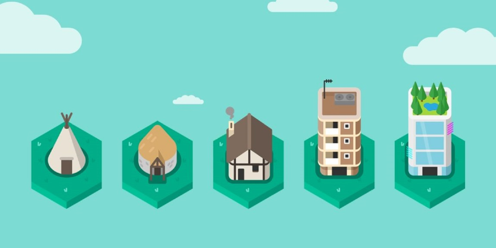

Run An Empire is a free to play mobile game where players capture territory by walking in the real world and build an empire on the acquired land. The ultimate goal for the player is too take care of their people and guide them through the eras.

App Store page: [Run An Empire for iOS](https://apps.apple.com/gb/app/run-an-empire/id1073986257)

Google Play page: [Run An Empire for Android](https://play.google.com/store/apps/details?id=com.lgl.runanempire)

### [Stride](https://apps.apple.com/ca/app/stride-run-hike-walk/id1526274172)

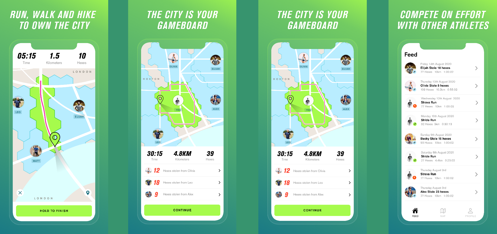

A second take on the core concept of territory capture, Stride is a fitness app where you compete with everyone else for the most territory. You go for runs or walks to encircle and capture land. The app also provides stats about your fitness performance.

App Store page: [Stride for iOS](https://apps.apple.com/ca/app/stride-run-hike-walk/id1526274172)

Google Play page: [Stride for Android](https://play.google.com/store/apps/details?id=com.lgl.stride)

# Personal Projects

### [Crate Mates](https://store.steampowered.com/app/1750600/Crate_Mates/)

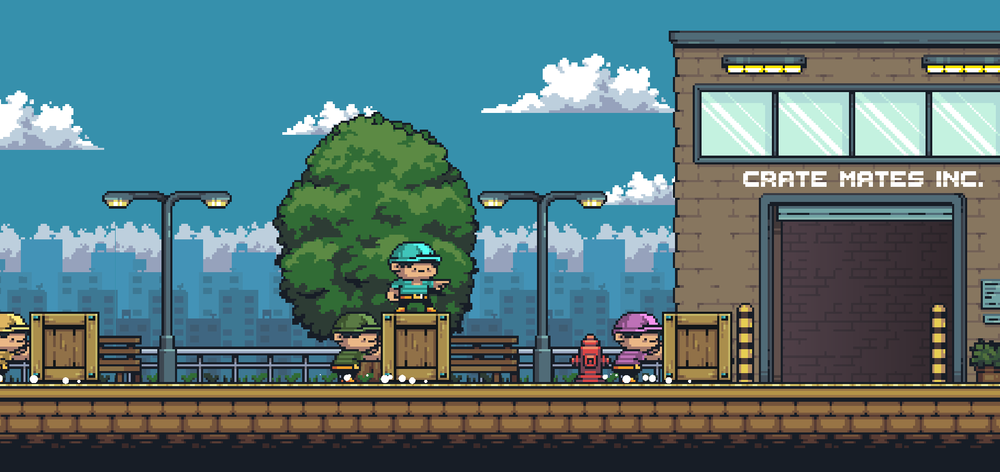

Crate Mates is a puzzle game where the player controls "mates" to store "crates". It's an original take on a very old puzzle game formula.

Steam page: [Crate Mates for Windows and Linux](https://store.steampowered.com/app/1750600/Crate_Mates/)

Google Play page: [Crate Mates for Android](https://play.google.com/store/apps/details?id=com.gibson.puzzle.game.sokoban.cratematesinc)

### [City Maker](https://store.steampowered.com/app/1540910/City_Maker/)

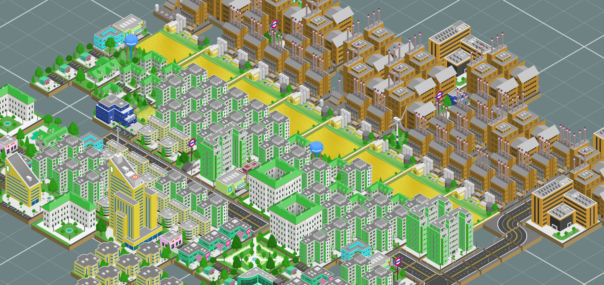

A mix between a city building game and a casual puzzle game. The player builds a city but the catch is that they can only pick from 3 possible buildings at any given time. They have to learn to both make sure that the cities organization fulfils the needs of its citizens and that the infrastructure cost don't exceed the city's revenue.

Steam page: [City Maker for Windows](https://store.steampowered.com/app/1540910/City_Maker)

Google Play page: [City Maker for Android](https://play.google.com/store/apps/details?id=com.Gibson.CityMaker)

### [Drift Maker](https://play.google.com/store/apps/details?id=com.DriftMakerInc.DriftMaker)

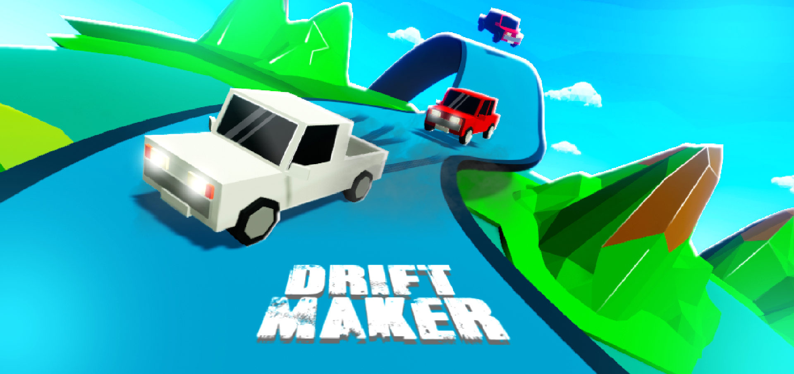

Mobile game where the player controls a car and must complete a set of increasingly hard tracks. 

The game also has an online component that allows players to create there own tracks or player those of others.

Google Play Store page: [Drift Maker for Android](https://play.google.com/store/apps/details?id=com.DriftMakerInc.DriftMaker)

### [The Climb](https://gibss.itch.io/the-climb)

The player guides a herd of cat to the top of the mountain before the flood gets them.

Itch.io page: [The Climb for Windows](https://gibss.itch.io/the-climb)

Google Play page: [The Climb for Android](https://play.google.com/store/apps/details?id=com.Gibson.TheClimb)

### [Postman Tap](https://postmantap.com/)

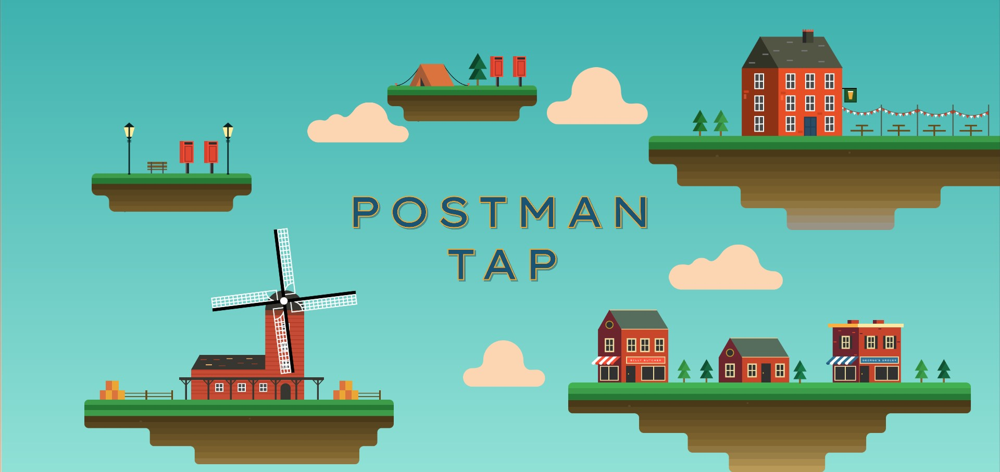

Building on a game I mention further down, the player controls a postman on a mission to deliver mail in a small airborne village.

It's a simple casual mobile game with a light meta progression.

Google Play Store page: [Postman Tap for Android](https://play.google.com/store/apps/details?id=com.game.glider.postman)

App Store page: [Postman Tap for iOS](https://apps.apple.com/us/app/postman-tap/id1516236231)

### [Orders of the King](https://gibss.github.io/test/orders-of-the-king/v0.1)

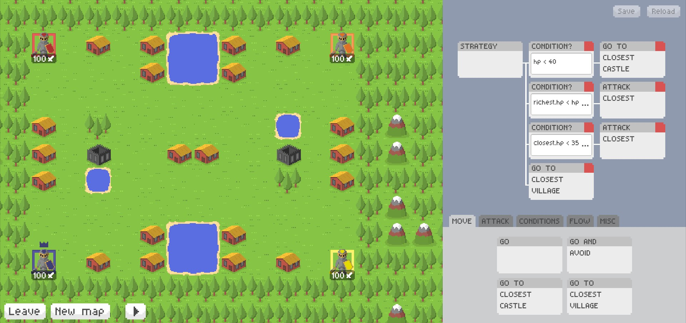

Online multiplayer game (can be played alone) where the player defines a strategy using [behaviour trees](https://www.gamasutra.com/blogs/ChrisSimpson/20140717/221339/Behavior_trees_for_AI_How_they_work.php) for your medieval army to follow.
Your goal is to annex the most villages and levy the most taxes off of them.

### [Glider boy](https://play.google.com/store/apps/details?id=com.company.shieldboy)

A very modest infinite runner for mobile. My first attempt at making an ultra casual mobile game and first solo project.

# Ludum Dare submissions

I started regularly participating in the Ludum Dare competition: a global game jam where participants try to create a game in 3 days, the theme is picked by the community.

### [LD 49: Lab Panic!](https://ldjam.com/events/ludum-dare/49/lab-panic)

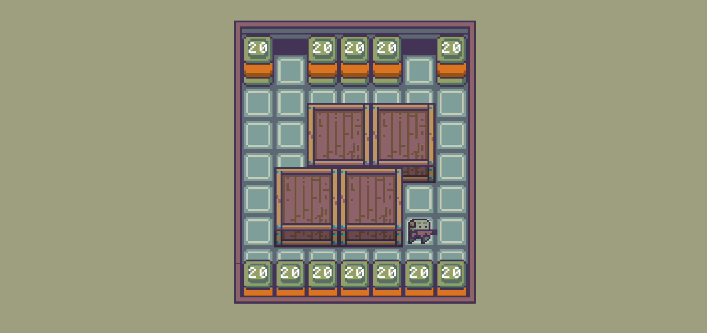

Imposed theme: Unstable

Puzzle game where the player must survive the imminent explosion of a bunch of vat of goo.

Ludum dare page: [Lab Panic!](https://ldjam.com/events/ludum-dare/49/lab-panic)

### [LD 48: Asteroid Breaker](https://ldjam.com/events/ludum-dare/48/asteroid-breaker)

Imposed theme: Deeper and deeper

The player controls a drill and must reach the core of the asteroid without being destroyed.

Ludum dare page: [Asteroid Breaker](https://ldjam.com/events/ludum-dare/48/asteroid-breaker)

### [LD 47: Once More](https://ldjam.com/events/ludum-dare/47/once-more-dear-friends)

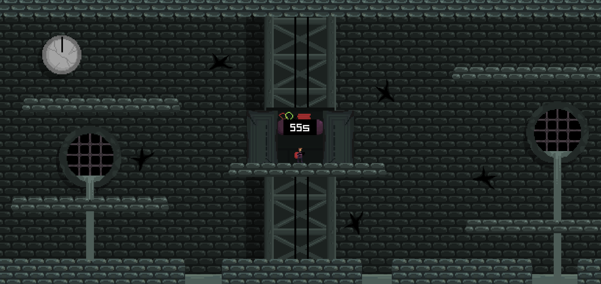

Imposed theme: Stuck in a Loop

2D Shoot them up with a twist. The player must just survive 55 seconds. How hard can it be?

Overall: 138th/3206

Fun: 44th/3206

Ludum dare page: [Once More](https://ldjam.com/events/ludum-dare/47/once-more-dear-friends)

### [LD 46: Darkness Draws Near](https://ldjam.com/events/ludum-dare/46/darkness-draws-near)

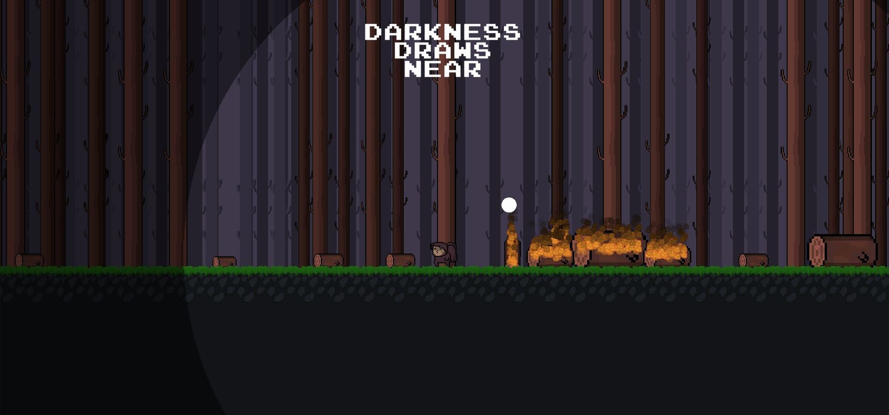

Imposed theme: Keep it Alive

The player must survive the night in some cursed woods. To do that they must use their wood to both maintain a fire and to carve out arrows to fight off enemies.

Ludum dare page: [Darkness Draws Near](https://ldjam.com/events/ludum-dare/46/darkness-draws-near)

### [LD 45: In the Beginning](https://ldjam.com/events/ludum-dare/45/in-the-beginning-3)

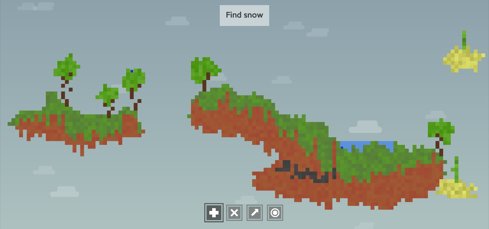

Imposed theme: Start with Nothing

The player creates a world starting with nothing.

Overall: 18th/5838

Innovation: 47th/5838 

Theme: 7th/5838

Ludum dare page: [In the Beginning](https://ldjam.com/events/ludum-dare/45/in-the-beginning-3)

# Playable prototypes

Fully playable prototypes, usually missing art and too rough to be worth bringing to completion.

### [Vertical scape](https://gibss.github.io/test/vertical-scape/v0.4)

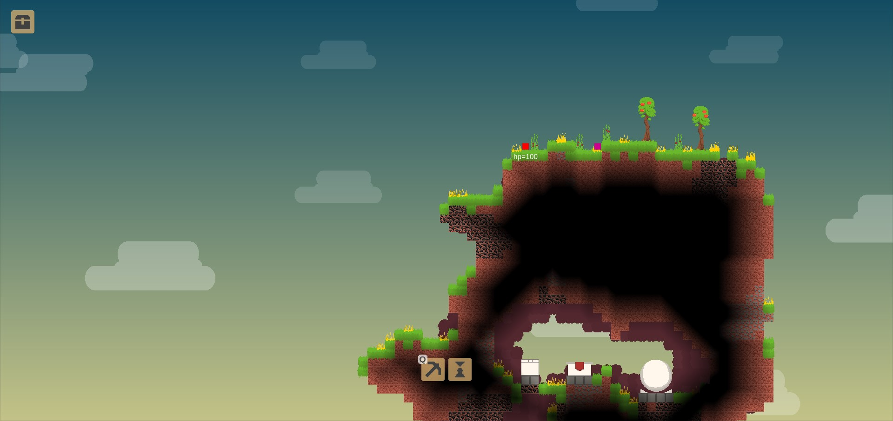

A mix between a terraria like game and a colony management game. It's very light on content and mostly showcases a very simple core loop.

### [Goo ship](https://gibss.github.io/test/goo-ship/Prototype)

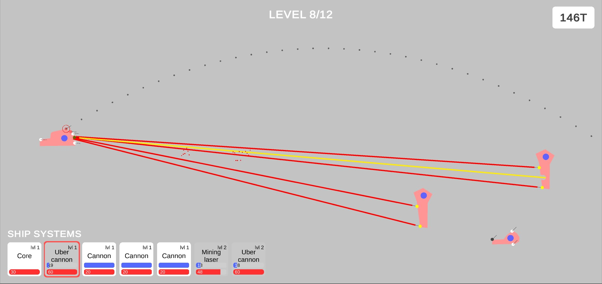

FTL meets worms: The player controls a ship in a 2D-platformer environment and uses its different systems (weapons, augmentations..) to defeat enemy ships. The worms bit is that both ships and the world is destructible.

Make sure to play in fullscreen mode.

### [Cannon automaton](https://gibss.github.io/test/cannon-automaton-2)

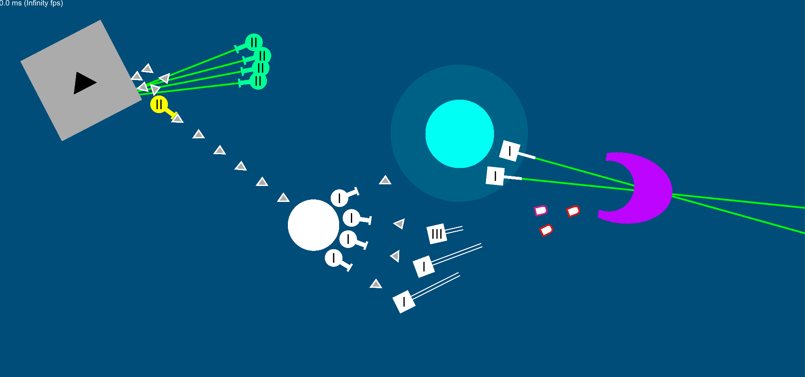

Harvest resources to be able to purchase defenses and protect yourself from incoming waves of enemies. There is no tutorial so this might be a bit rough to learn but the jist of it is: place mining lasers to harvest resources, spend those resources to place more miners or more defenses. The enemies come from the right hand side of the screen.

### [Horizon Army](https://gibss.github.io/test/landmark-project/v0.5/index.html)

Digital card game of sorts where the player collects medieval fantasy soldiers. With those soldiers they try to create the most optimal army to compete online against other players' armies. It is almost finished, the main missing piece as you can see is the art. Although it is hard to make out, it is fully playable and there is a short tutorial to onboard the player on how to make armies.

### [Minute Miner](https://gibss.github.io/test/minute-miner/v0.2/index.html)

The player must last 20 minutes by harvesting minerals and buying defenses in an ever growing mine. 

### [Grapple](https://gibss.github.io/test/grapple-world/index.html)

A prototype for the first level of a super meat boy, celeste, vvvvv like 2d platformer. The player moves through space using a grappling hook.

### [Arrows](https://gibss.github.io/test/arrows/index.html)

Messing around with the concept for a 2D platformer focused around archery, destructible terrain and fighting large enemies.

# Libraries

### [Unity Mask Lighting](https://github.com/GibsS/unity-mask-lighting)

A library to reproduce a specific type of lighting in 2D games.

### [Unity Behaviour Tree](https://github.com/GibsS/unity-behaviour-tree)

There is probably a plethora of behaviour tree libraries for Unity but most of them focus on making it "designer" friendly and UI driven. I wanted to make a library that gave programmers a simple framework to create complex AI behaviours through behaviour trees. So I made this library. One of it's main feature is the use of C# IEnumerables to allow developers to write dynamic behaviour tree nodes and have a lot of control without having to create over complicated trees with hundreds of nodes.

### [Gridlike](https://www.npmjs.com/package/grid-like)

When looking at javascript 2D physics engines for HTML5 games, I felt like it was always painful to have some wrapper code around the physics library in order to do very simple things like create a controlable character, have him stay still on moving platforms..

So I made Gridlike: A typescript physics engine (compiled to javascript) designed for creating 2d voxel games and designed to make character implementation extremely quick.

[testbed](https://gibss.github.io/test/gridlike)

[github page](https://github.com/GibsS/gridlike)

[npm page](https://www.npmjs.com/package/grid-like)

### [Pan And Zoom](https://github.com/GibsS/unity-pan-and-zoom)

A simple Unity script to implement 2D camera control for mobile games and desktop alike. 
